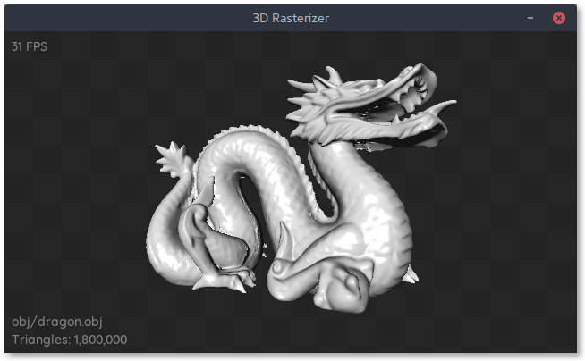

# 3D Software Rasterizer
3D Software Rasterizer in C++


[Standford Dragon](http://graphics.stanford.edu/data/3Dscanrep/)


This is a C++ rewrite of my original [Python software renderer](https://github.com/JamesGriffin/SoftwareRenderer).

## Building

This project requires SDL2 and SDL2_ttf. These can be installed on an Ubuntu system via the package manager:

```
$ sudo apt install libsdl2-dev libsdl2-ttf-dev
```

Create a build directory and compile using CMake:
```
$ mkdir build && cd build
$ cmake ..
$ make
```

## Running

```
$ ./rasterizer
```
